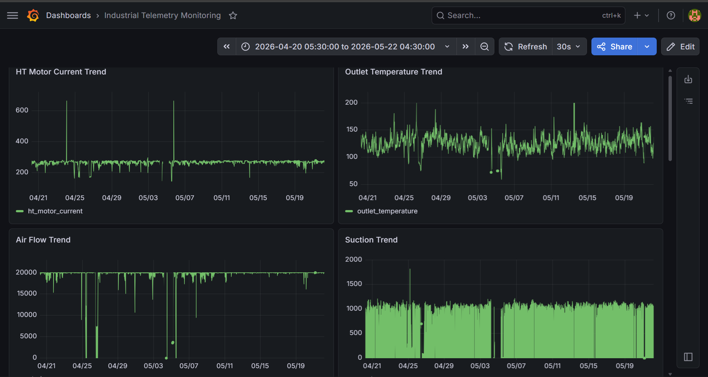
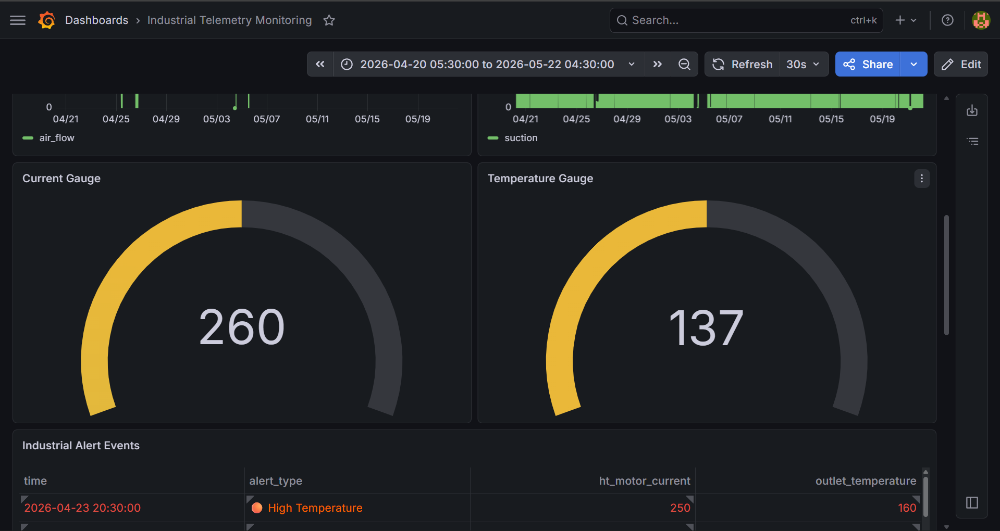
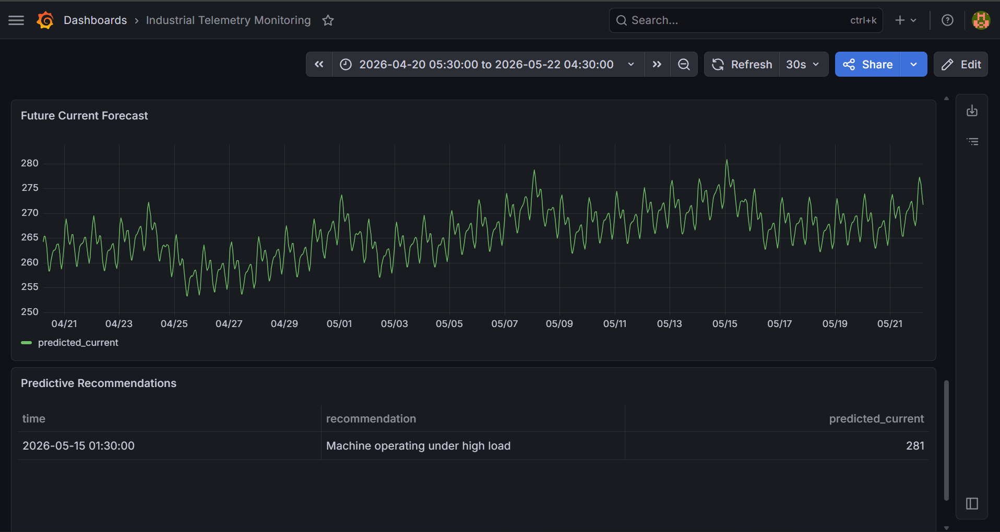
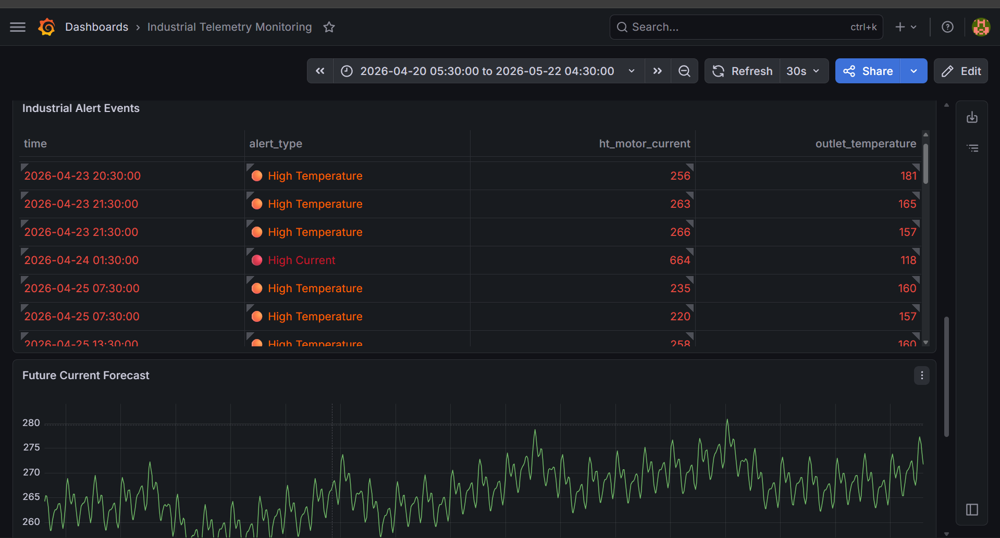

# Industrial Energy Optimization & Monitoring System for Sinter Plant Machinery

## Project Overview

This project is an Industrial Telemetry Analytics Platform developed using real sinter plant machinery telemetry data.

The system collects, stores, analyzes, visualizes, and predicts machine behavior to improve operational monitoring and energy optimization in industrial environments.

## Features

- Industrial telemetry ingestion using Python
- PostgreSQL backend for telemetry storage
- Grafana SCADA-style dashboards
- Industrial anomaly detection engine
- Predictive forecasting using Prophet
- Intelligent recommendation system

## Tech Stack

### Languages
- Python
- SQL

### Libraries
- Pandas
- NumPy
- Matplotlib
- Prophet
- SQLAlchemy

### Database
- PostgreSQL

### Dashboarding
- Grafana

## System Architecture

Telemetry CSV Data
        ↓
Python + Pandas
        ↓
PostgreSQL Database
        ↓
Grafana Dashboards
        ↓
Anomaly Detection
        ↓
Forecasting Engine
        ↓
Recommendation System

## Dashboard Features

- Motor Current Trend Monitoring
- Temperature Trend Analysis
- Air Flow Monitoring
- Industrial Alert Panels
- Forecast Visualization
- Predictive Recommendation Panels

## Forecasting & Predictive Analytics

The system uses Prophet time-series forecasting to predict future machine current trends and identify potential overload conditions before occurrence.

Forecast-based warnings and intelligent operational recommendations are generated to support predictive industrial monitoring.

## Dashboard Screenshots

### Main Dashboard

### Current Gauge

### Predictive Recommendations

### Industrial Alerts

## Future Scope

- Predictive Maintenance
- IIoT Integration
- Digital Twin Systems
- Edge Analytics
- Cloud Deployment
- Industrial AI Optimization

## Author

Developed as an Industrial Internship Project focused on telemetry analytics, predictive monitoring, and industrial energy optimization.