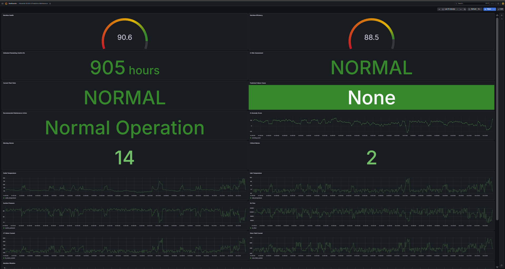
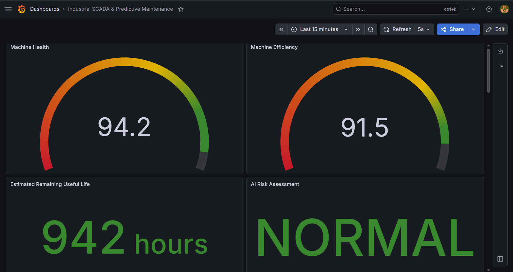
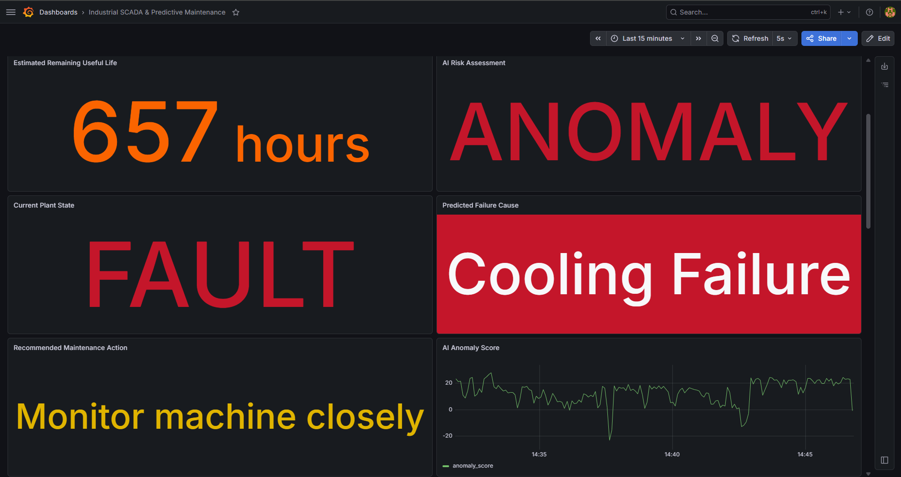
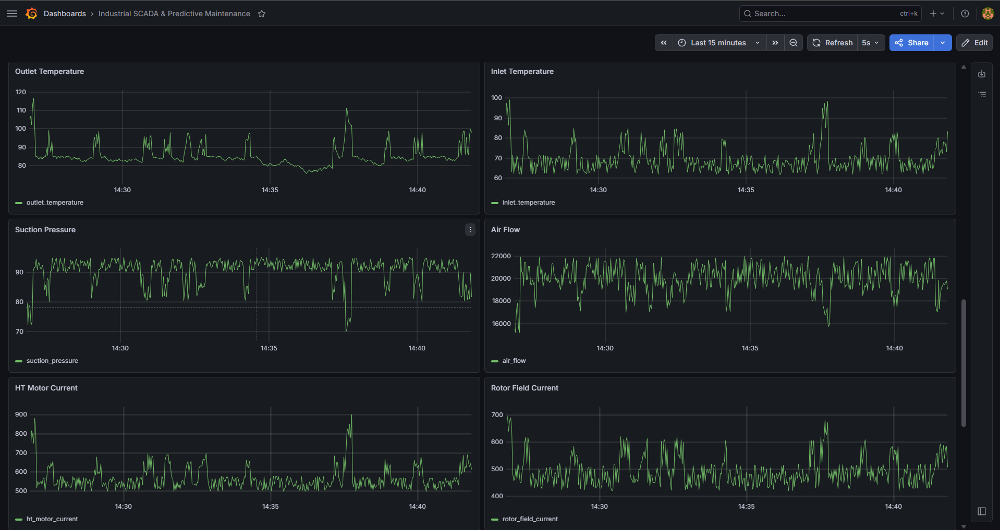
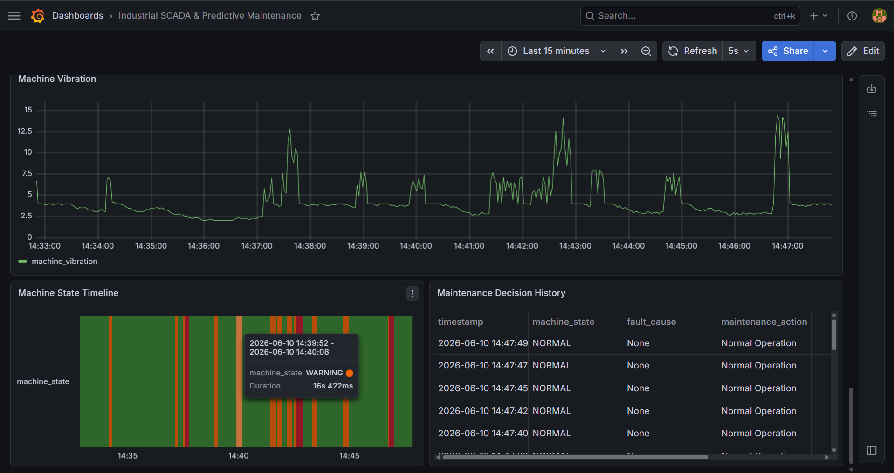

# Industrial SCADA & Predictive Maintenance Platform

A Dockerized Industrial SCADA and Predictive Maintenance Platform inspired by an Exhauster used in a Steel Plant. The project was developed to simulate real-world industrial condition monitoring, fault diagnosis, predictive maintenance, and machine health assessment workflows commonly found in heavy manufacturing environments such as steel production facilities.

The platform generates realistic telemetry data, models machine degradation and fault conditions, estimates Remaining Useful Life (RUL), performs AI-based anomaly detection using Isolation Forest, and visualizes operational insights through a Grafana-based SCADA dashboard.

---

## Key Highlights

* Real-time industrial telemetry simulation
* Condition monitoring and fault diagnosis
* Remaining Useful Life (RUL) estimation
* AI-based anomaly detection using Isolation Forest
* Automated maintenance recommendations
* Alarm management and event logging
* PostgreSQL time-series storage
* Grafana SCADA visualization
* Dockerized multi-service architecture

---

## System Architecture

```text
                        ┌─────────────────────┐
                        │ Python Simulator    │
                        │ Industrial Machine  │
                        └──────────┬──────────┘
                                   │
                                   │ Telemetry
                                   ▼

                    ┌────────────────────────────┐
                    │ PostgreSQL Database        │
                    │ industrial_telemetry       │
                    └───────┬───────────┬────────┘
                            │           │
                            │           │
                            ▼           ▼

              ┌─────────────────┐   ┌──────────────────┐
              │ Grafana SCADA   │   │ ML Engine        │
              │ Visualization   │   │ Isolation Forest │
              └─────────────────┘   └─────────┬────────┘
                                               │
                                               ▼

                                    ┌─────────────────┐
                                    │ AI Predictions  │
                                    └─────────────────┘
```

---

## Technology Stack
## Core Concepts

- SCADA
- Predictive Maintenance
- Industrial IoT
- Condition Monitoring
- Fault Diagnosis
- Remaining Useful Life (RUL)
- Anomaly Detection
- Time-Series Analytics

### Programming & Data

* Python
* SQL

### Database

* PostgreSQL 16

### Visualization

* Grafana

### Machine Learning

* Scikit-Learn
* Isolation Forest

### Deployment

* Docker
* Docker Compose

---

## Simulated Industrial Parameters

The simulator continuously generates realistic telemetry for:

* Outlet Temperature
* Inlet Temperature
* Suction Pressure
* Air Flow
* HT Motor Current
* Rotor Field Current
* Machine Vibration
* Machine Health
* Machine Efficiency
* Remaining Useful Life (RUL)

Sensor drift is incorporated to simulate realistic industrial operating behavior.

---

## Machine States

The system operates through three industrial states:

### NORMAL

Machine operating within expected limits.

### WARNING

Abnormal conditions detected requiring monitoring.

### FAULT

Critical operating condition requiring immediate intervention.

State transitions:

```text
NORMAL → WARNING → FAULT → NORMAL
```

---

## Fault Diagnosis

The platform simulates common industrial equipment failures.

### Bearing Failure

Characteristics:

* Increased vibration
* Reduced machine health

Recommended Action:

* Inspect Bearings Soon

---

### Cooling Failure

Characteristics:

* Elevated outlet temperature
* Reduced efficiency

Recommended Action:

* Check Cooling System

---

### Motor Overload

Characteristics:

* High motor current
* Reduced machine health

Recommended Action:

* Inspect Motor Load

---

## Machine Health Model

Machine health is calculated from equipment operating conditions.

Factors considered:

* Machine vibration
* Outlet temperature
* HT motor current

Health is normalized between:

```text
0 – 100
```

Higher vibration, temperature, and current reduce overall machine health.

---

## Machine Efficiency

Machine efficiency is derived from:

* Machine health
* Air flow
* Pressure conditions
* Vibration levels

Typical operating range:

```text
40 – 100 %
```

---

## Remaining Useful Life (RUL)

Remaining Useful Life estimates the number of operating hours before maintenance becomes necessary.

Characteristics:

* Decreases as health degrades
* Supports predictive maintenance decisions
* Displayed as a live KPI in Grafana

Typical range:

```text
300 – 1000 Hours
```

---

## AI Anomaly Detection

The AI engine uses Isolation Forest for unsupervised anomaly detection.

Configuration:

```python
IsolationForest(
    contamination=0.03,
    n_estimators=150
)
```

Outputs:

* NORMAL
* ANOMALY

The AI model operates independently from simulator state logic, allowing realistic differences between operational status and anomaly predictions.

---

## Database Design

The complete PostgreSQL schema is available in:

sql/schema.sql

### sensors

Stores machine telemetry and predictive maintenance information.

Key fields:

* timestamp
* outlet_temperature
* inlet_temperature
* suction_pressure
* air_flow
* machine_vibration
* machine_health
* machine_efficiency
* machine_state
* fault_cause
* maintenance_action
* estimated_rul

### alarms

Stores alarm information.

### machine_events

Stores operational events and state transitions.

### ai_predictions

Stores anomaly scores and AI predictions.

---

## Grafana Dashboard

The dashboard provides:

### Executive KPIs

* Machine Health
* Machine Efficiency
* Estimated Remaining Useful Life
* AI Prediction

### Decision Support

* Current Plant State
* Predicted Failure Cause
* Recommended Maintenance Action

### Alarm Monitoring

* Warning Alarm Count
* Critical Alarm Count
* AI Anomaly Score

### Telemetry Trends

* Outlet Temperature
* Inlet Temperature
* Suction Pressure
* Air Flow
* HT Motor Current
* Rotor Field Current
* Machine Vibration

### Historical Analysis

* Machine State Timeline
* Maintenance Decision History

---

## Dashboard Screenshots

### Dashboard Overview



The complete SCADA dashboard showing machine KPIs, AI predictions, alarm statistics, maintenance recommendations, and live telemetry monitoring.

---

### Executive KPIs



Key performance indicators including Machine Health, Machine Efficiency, Remaining Useful Life (RUL), and AI Risk Assessment.

---

### Fault Detection & Maintenance Recommendation



Example fault scenario showing anomaly detection, fault diagnosis, machine state assessment, and recommended maintenance actions.

---

### Telemetry Monitoring



Live industrial telemetry trends including temperature, pressure, airflow, motor current, rotor field current, and machine vibration.

---

### Historical Analysis



Machine state timeline and maintenance decision history used for operational analysis and traceability.

---

## Project Structure

```text
industrial-scada-predictive-maintenance/

├── Screenshots/
│   ├── dashboard-overview.png
│   ├── executive-kpis.png
│   ├── fault-detection.png
│   ├── telemetry-monitoring.png
│   └── historical-analysis.png

├── simulator/
├── ml_engine/
├── sql/
│   └── schema.sql

├── notebooks/
├── data/

├── docker-compose.yml
├── requirements.txt
└── README.md
```

---

## Learning Outcomes

This project demonstrates:

* Industrial SCADA Concepts
* Predictive Maintenance
* Condition Monitoring
* Fault Diagnosis
* Industrial IoT Simulation
* Time-Series Data Engineering
* Machine Learning for Industrial Systems
* Dockerized Deployments
* Real-Time Data Visualization

---

## Industrial Inspiration

This project was inspired by industrial exhausters used in steel manufacturing processes and was developed based on concepts explored during an internship at SAIL Bokaro Steel Plant. The objective was to recreate key Industrial IoT, SCADA, condition monitoring, and predictive maintenance workflows in a simulated environment for learning and engineering analysis.

---

## Future Improvements

* OPC-UA Integration
* MQTT Data Ingestion
* Modbus TCP Connectivity
* PLC Integration
* Supervised Failure Prediction Models
* Automated Email/SMS Alerting
* Multi-Machine Monitoring

---

## Author

Pratyush Ranjan

LinkedIn: www.linkedin.com/in/pratyush-ranjan-9468253a1

GitHub: https://github.com/pratyushhx
